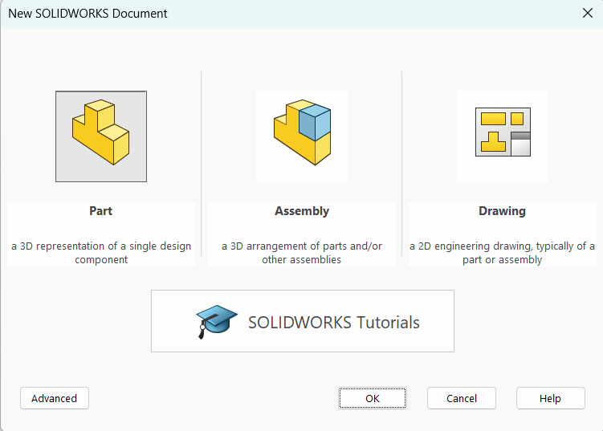
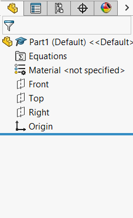
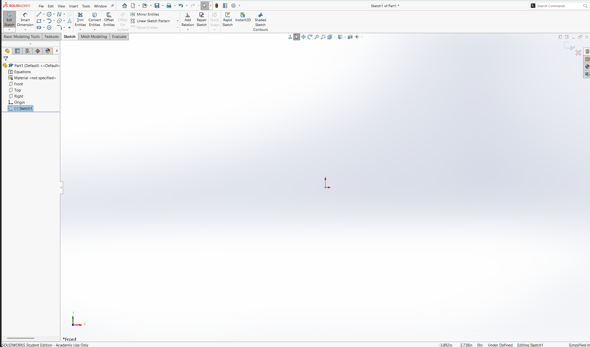

import { Steps, Card } from '@astrojs/starlight/components';
import { Tabs, TabItem } from '@astrojs/starlight/components';

import { Image } from 'astro:assets';

:::tip
    This lesson is currently only for Solidworks, which is a paid software and only works on Windows computers. We are looking for contributors to create versions for other softwares such as OnShape. If you are interested, please see [the contributing page](/getting-started/contributing)
:::

:::danger
    This guide is unfinished. Only the end is written below.
:::

## Page Setup
Upon opening Solidworks, the first thing you will see is a mostly empty screen with a toolbar on the top and on the right. To create a [Part](https://help.solidworks.com/2025/english/solidworks/sldworks/c_Overview_and_Editing_Parts_Folder.htm), we can look at the top left of the window and navigate through the menu to `File>New...` (Alternatively pressing `Ctrl-n`).

The window above will open up. For now we will select `Part`, then click `OK`. 

Once inside a part, we will see a lot of new options show up.

On the left is a new sidebar which is by default set to the [Feature Tree](https://help.solidworks.com/2025/english/solidworks/sldworks/c_featuremanager_design_tree.htm), which will show all of the features we add to our model as we go.

The main window is currently empty, however it is called the `Viewport`, and it is where we will be directly creating the 3D models. We can scroll in and out using the scroll wheel, we can rotate the model by holding `MMB (middle-mouse-button)` and moving the mouse, and we can pan the screen with `MMB-Ctrl` while moving the mouse (especially useful for Sketches).

The first thing to check for is the units of the document. In Mechmania, we use metric, but Solidworks often defaults to imperial. If we look up once again at the top toolbar, we can navigate to `Tools>Options>Document Properties>Units`.

We want to set our units to `MMGS`, or to millimetres, grams, and seconds. Once that is done, click `OK` at the bottom of the window.

