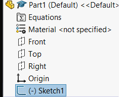
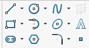
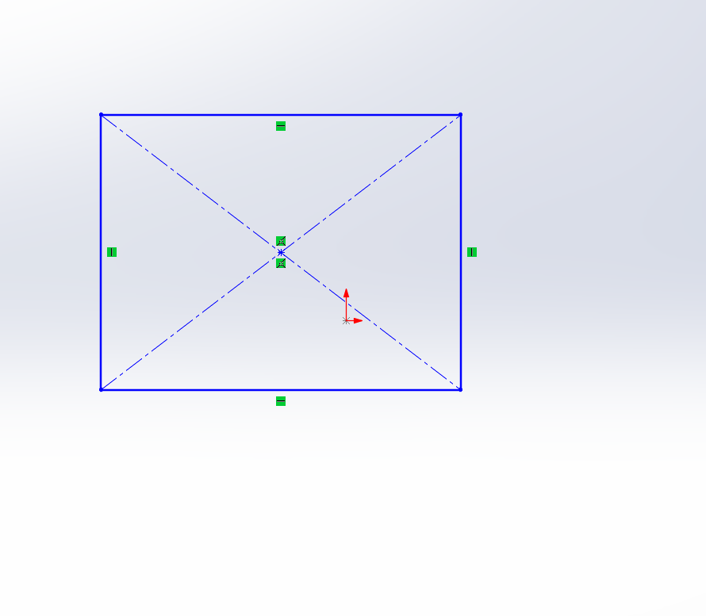
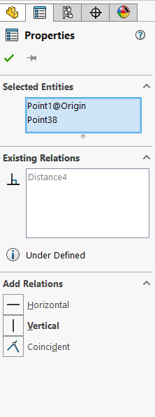
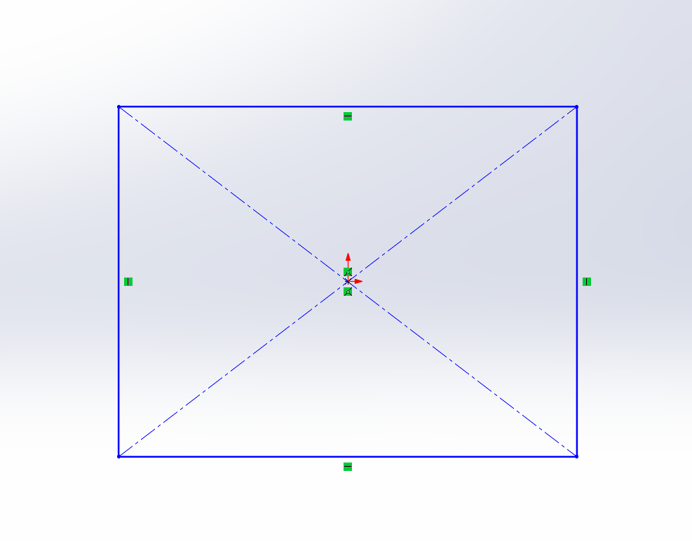
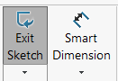
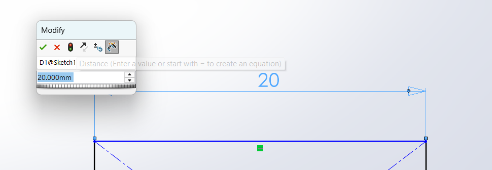
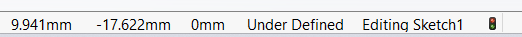
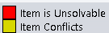
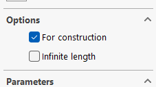

:::tip
    If you are ever stuck reading this lesson, be sure to check the [Solidworks docs](https://help.solidworks.com/2025/english/SolidWorks/sldworks/r_welcome_sw_online_help.htm?id=0), as it has a lot of useful information.
:::

In every part, the first thing we want to do is create a [Sketch](https://help.solidworks.com/2025/english/SolidWorks/sldworks/c_sketching_top.htm?id=28). Sketches are planes on which we can create 2D shapes and contours, which can then be brought into 3D in a variety of ways. They are the backbone of all designing in Soldiworks. 

#### Creating sketches

We can create one by navigating to the `Sketch` tab in the the top left, then clicking the `Sketch` option.

Once clicked, we will see the three reference planes in our viewport window. Reference planes are infinite 2D objects used as a reference for sketches. In every new Part, there exists one for each standard axis, where the Top, Front, and Right planes are along the Y, X, and Z axes, respectively. The red (or blue) arrows in the middle represents the location of the *origin*, or where the coordinates of the part are equal to `(0,0,0)`. It is a fixed point, and the starting point for all parts.

We can click on any one of the planes to put our sketch there, and then the view will pan so that the sketch appears in 2D. We will put our first sketch along the front plane, as is standard for most parts. If we accidentally pan off of this view, we can reset it with the command `Ctrl-Space`, which will allow us to re-align our orientation.

Once we click this, we can now see that the sketch has appeared in our Feature Tree. 
If you exit the sketch accidentally, click on the sketch feature in the Feature Tree, then click the `Edit Sketch` icon to re-enter it.

#### Creating Sketch Features
To draw on the sketch, we look back up to the top bar, where a number of sketch tools lay, each of which we can access by clicking on them.

Here is a brief description of some of the most common sketch tools by name and location on the grid above. Many of the tools have variants, which can be accessed by clicking the dropdown arrows next to the general icons.

The best way to figure out what each of the sketch tools do and how they work is by experimenting yourself, however it is important to know that you can exit out of any operation simply by pressing the escape key, and that sketch lines can be deleted by selecting them, right clicking, then clicking `delete`.

After making some shapes, it becomes clear that each shape we make, even if they are chained to each other, is able to be moved around and reformed freely, which is not ideal for making precise and dimensioned models.

To fix this, we must add dimensions and relations to our sketches until our model is [fully defined](https://help.solidworks.com/2026/english/SolidWorks/sldworks/c_Fully_Defined_Sketches.htm?id=27.19.1.23). 

### Relations

[Sketch relations](https://my.solidworks.com/reader/onlinehelp/2021%252Fenglish%252Fsolidworks%252Fsldworks%252Fc_relations_top.htm/) are used to constrain the geometry of a sketch, and provide structure. Relations determine things like which lines, arcs, and points intersect, which ones are coincident, vertical, horizontal, colinear, and all manner of other geometrical features.

As an example, we can create and relation a `center rectangle` (In the drop down menu of the rectangle icon in the, 1st column and 2rd row in the tools image above).

We can see that there exist on each line and point small green icons. These are some relations which are created by default when creating the center rectangle to provide the correct structure; they constrain the boundary lines, the diagonal lines, and the centre lines relative to each other to form a rectangle.

#### Creating relations

In general, to create a relation, we select every sketch element which is to share the relation (using shift-click or drag-select to select multiple), then select the appropriate relation.

In this case, we will select the origin and the centerpoint of the rectangle. After selecting, a menu will appear on the left with all of the available sketch relations we can choose.

From here, the relation we pick is based on what we want its behaviour to be. 
If we wanted to force the two points to be on the same vertical or horizontal line, we would pick either the `vertical` or `horizontal` relation, respectively. Since we want, however, to force the points to occupy the exact same space, we can pick `coincident`.

To confirm our selection, we can click on the green checkmark icon in the top left of the panel.

#### Inferencing

For some of the more commonly used relations, Soldiworks will sometimes "infer" relations based on the entities created in the viewport window, which save time from needing to go through the process above. For example, instead of forcing two points to be `coincident` through the method above, we can often simply click and drag the point to another point, where it will become coincident and create the relation.

#### Destroying relations

We can delete relations either by clicking on a sketch object, and deleting the desired relation from the `Existing Relations` tab on the left sidebar, or by right-clicking and deleting the small green icon representing it in the viewport.

### Dimensions

Relations provide structure, however they do not assign physical values which bind sketches to the real world. With dimensions we can assign length, distance, diametre and angle values to sketch entities.

#### Adding dimensions
To add dimensions we can use the `Smart Dimension tool`. 

If we click on an individual line, the dimension will show up by default as the current stored length of the line. We can edit this to be as long or short as we wish. Once satisfied with the length, we can click the green checkmark to confirm. If we want to change the dimension later, we can simply double-click the dimension label, and then Solidworks will allow us to edit our dimension.

To dimension distance or angle between two sketch entities, we can select two of them, and then dimension the distance/angle (whether it is distance or angle will determine on the sketch relations between the entities).

#### Destroying dimensions

We can destroy dimensions by right-clicking on the dimension icons, then clicking `delete`.

### Sketch definition

If a sketch is `Fully Defined`, that means it is completely constrained by relations and dimensions, every line should appear black and be unmovable when attempting to drag it around using the mouse. This is the ideal state of every sketch.

If a sketch is `Under Defined`, then the parts of it that remain mutable are coloured blue, and can be moved around with the mouse. With few exceptions, sketches should not be left like this, as it can cause many problems down the road in your designs.

You can see the status of your sketch in the bottom right of your screen, where it should say either `Under Defined`, `Fully Defined`, or `No Solution Found`.

### Over defining sketches

If you add too many relations/dimensions and the sketch becomes unsolvable by Solidworks, it will become `Over Defined`, and the status will show `No Solution Found`

The colours of the lines will either be red or yellow, according to this legend:

The simplest way to deal with overdefinition is to simply delete the offending relation or dimension and try to find another way to define your sketch.

### Construction Entities

By default, every sketch entity (lines, arcs, etc.) are solid lines, these lines group together to create the final composite shape, the `contour`, used for 3D operations. Contours are in general entirely closed; So there may not be a solid line in the sketch which does not form the boundary of a contour.

Most sketches, however, require entities whose purpose is to provide structure to the actual contour which is to be extruded. Those lines create open contours, and will cause Soldiworks to throw errors upon transitioning to 3D.

We can convert entities to `construction lines`, which appear dotted and will be ignored when creating contours, by clicking the `for construction` checkbox in the relations window.

