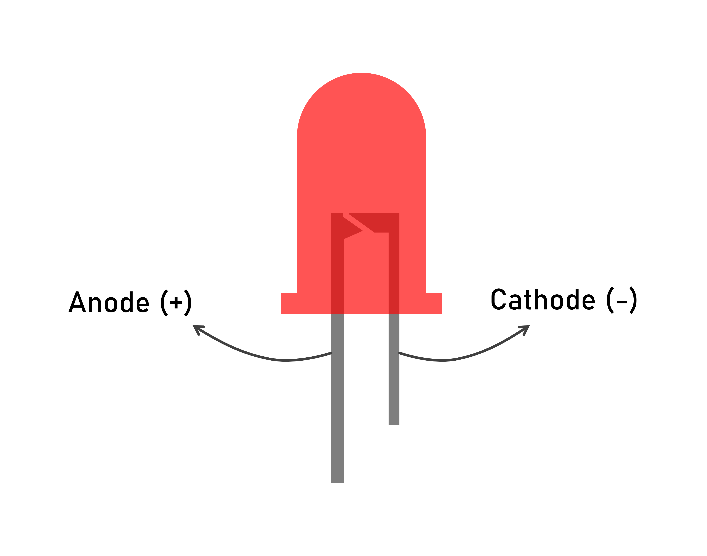

import { Card } from '@astrojs/starlight/components';
import { Image } from "astro:assets";

When designing and building electronics, engineers follow standard conventions to make circuits easier to understand.

## Safety

- Voltage ratings: make sure every component can handle the supplied voltage. 
- Polarity: confirm the positive (+) and negative (-) connections are correct. Avoid short circuits.
- Connections: ensure wires are secure and do not accidentally touch each other. 
- Current Limits: make sure components and wires can handle the expected current.

:::caution
Short circuits can cause large, unexpected amounts of current to flow through a system. This surge of current can create heat, sparks, or electrical fires.
:::

**What to Do in an Emergency**

If you spot a short circuit, smell burning, or see components overheating:

1. **Cut power immediately**: disconnect the battery or switch off the power supply.
2. **Tell someone**: alert a mentor, instructor, or teammate right away.
3. **Inspect & salvage**: work with others to safely check for damage and identify components that can still be saved.

## Power and Ground

- Power (+) supplies electrical energy to the circuit.
- Ground (-) provides the return path for current.

:::danger
Do NOT interchange the two, maintain proper polarity. Incorrect wiring can damage components or create a short circuit.
:::

Many components may use a **common ground** to communicate with each other properly. 

A **common ground** means connecting the ground lines (0V reference) of two or more separate power sources or circuits together. 

**Why it matters:** 
Signals are measured *relative* to ground. Without a shared ground reference, two components cannot accurately read data signals from each other, leading to erratic behavior.

**Example: LED Polarity**

## Wire Colours

Wire colours are commonly used to organize circuits:

| Colour | Common Purpose |
| --- | --- |
| Red | Positive power (+) |
| Black | Ground (-) |
| Yellow/White/Green/Blue | Signal lines & special connections |

The most important colours to remember are **Red (power)** and **Black (GND)**.

:::note
Wire colours are conventions, not rules. Always verify connections before applying power.
:::

## Wire Sizes

Wire size determines how much current a wire can safely carry.

- Thicker wires can carry more current.
- Thinner wires are used for low-power signals.

**Common Robotics Wire Gauges (AWG)**

American Wire Gauge (AWG) measures wire thickness (**smaller numbers mean thicker wires**).

| Gauge | Relative Size | Typical Current Limit | Common Robotics Use Case |
| --- | --- | --- | --- |
| **18 AWG** | Thicker | ~7–10 Amps | Main power rails, high-draw motors |
| **20 AWG** | Medium | ~3–5 Amps | Smaller motors, medium power distribution |
| **22 AWG** | Thinner | ~1–3 Amps | Low-power sensors, MCU* I/O pins, CAN bus |

*MCU - Microcontroller

Using an undersized wire can cause:

- Heat buildup
- Voltage drops
- Poor performance
- Wire damage

Choosing the correct size wire improves safety and reliability in circuits.