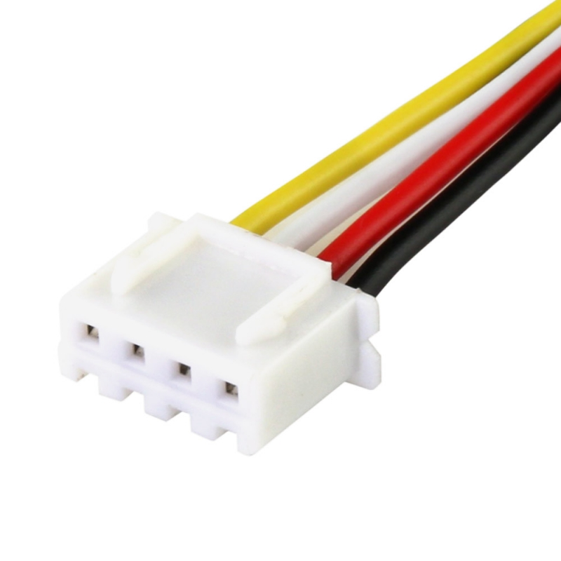

import { Card } from '@astrojs/starlight/components';
import { Image } from "astro:assets";

Batteries will power almost every robot you will build. Picking the right battery and knowing how not to destroy it (or your workplace) is one of the most important parts of electronics.

## Common Battery Types

Before looking at robotics-specific things, here is a quick overview of the main battery types you will run into:

| Type | Rechargeable? | Energy Density | Common Uses | Notes |
| --- | --- | --- | --- | --- |
| **Alkaline** | No | Low | Household remotes, AA/AAA packs | Cheap and easy, but voltage drops quickly under load. |
| **NiMH (Nickel-Metal Hydride)** | Yes | Medium | RC cars, power tools, older robotics | Safe and durable, but heavier than lithium options. |
| **Li-Ion (Lithium-Ion)** | Yes | High | Laptops, 18650 cells, power banks | Great energy capacity, but needs protection circuits. |
| **LiPo (Lithium Polymer)** | Yes | Very High | Drones, combat bots, FRC/FTC | High discharge rate; lightweight, but sensitive to damage. |
| **Lead-Acid** | Yes | Low | Cars, large heavy robots (FRC) | Very heavy and bulky, but cheap for high current. |

## Batteries we will use in robotics

In our setup, we mainly stick to three power options depending on what part of the robot we are running:

* **3S LiPo Batteries (11.1V):** Used for driving motors, high-torque servos, and ESCs. They pack a ton of power in a small size, but require strict handling.
* **AA Batteries in Holders (4.5V–6V) and 9V Batteries (converted to 5V):** Great for simple low-power setups, basic motor drivers, or quick breadboard tests.

## Understanding 3S LiPo Voltages

A **3S LiPo** means there are **3 individual cells inside connected in series**. Each cell has a strict voltage range you need to keep track of:

* **Full Charge:** 12.6V total (4.2V per cell)
* **Nominal (Rated) Voltage:** 11.1V total (3.7V per cell)
* **Safe Storage Voltage:** ~11.4V total (3.8V per cell)
* **Never Go Below:** 9.0V–9.9V total (3.0V–3.3V per cell)

:::danger
If you discharge a LiPo cell below **3.0V**, it permanently ruins the internal chemical structure.  
If a battery swells or turns squishy ("puffs"), stop using it immediately.
:::

## Battery Safety Rules

:::caution
LiPo batteries hold a lot of energy and can discharge it very fast.  
A short circuit or punctured cell can cause fire or burns.
:::

Follow these basics every time you handle batteries:

* **Check for damage:** Look for puffing, exposed wires, torn shrink wrap, or bent pins before plugging anything in.
* **Avoid short circuits:** Never let bare positive (red) and negative (black) leads touch.
* **Unplug when done:** Disconnect batteries when the robot is turned off or being transported.
* **Pull by the plug:** Always grip the plastic connector when pulling a plug—never yank the wires directly.

### What to Do in an Emergency

If a battery starts puffing up, getting hot, smoking, or sparking:

1. **Cut power or disconnect** immediately if safe to touch.
2. **Tell a mentor or team member** right away.
3. **Move it to a safe spot** (like a LiPo bag or concrete floor) using pliers or heat-resistant gloves if it is hot.
4. **Never use water on a LiPo fire.** Use sand or a Class D / Dry Chemical extinguisher.

## Charging & Maintenance

LiPo batteries cannot be plugged into a simple wall adapter—they require a **balance charger**. This will be provided by us.

**Balance charger basics**

The charger we will provide is powered via a USB-C cable.  
Plug the USB-C cable into a charging brick, then plug your battery’s 4-pin JST-XH* connector into the charger in the correct orientation, and monitor the light on the charger.

**JST-XH Connector**:

This allows the charger to monitor each of the 3 cells individually so none of them get overcharged. Upon plugging the battery in to charge, the charger will light up.

- **Green = charged**  
- **Red = still charging**

## Things to keep in mind while charging

* **Never leave it unattended:** Don't leave batteries charging alone in a room.
* **Do not overcharge:** If the battery is charged past its limit of 4.2 V per cell, all the extra electrical energy is converted to **heat**.
* **Charge inside a LiPo bag if possible:** Place the battery inside a fire-resistant LiPo bag while charging.