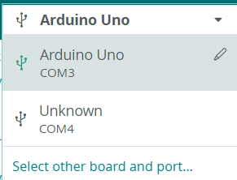

The first step in using the Arduino IDE is by uploading code to the desired microntrollers, a process called *flashing*. 


For our purposes we are going to use the standard [Blink](https://docs.arduino.cc/built-in-examples/basics/Blink/) program provided by Arduino, which will blink the built-in LED on an Arduino.

```c++
/* 
    Blink

    Code sourced from
    https://docs.arduino.cc/built-in-examples/basics/Blink/
*/
// use pin 13 (usually where the built-in LED exists)
#define LED 13

// the setup function runs once when you press reset or power the board
void setup() {
  // initialize digital pin LED as an output.
  pinMode(LED, OUTPUT);
}

// the loop function runs over and over again forever
void loop() {
  digitalWrite(LED, HIGH);  // change state of the LED by setting the pin to the HIGH voltage level
  delay(1000);                      // wait for a second
  digitalWrite(LED, LOW);   // change state of the LED by setting the pin to the LOW voltage level
  delay(1000);                      // wait for a second
}
```


To start, open-up your Arduino IDE, then plug in your board to a USB port on your computer. Click `Select Board`, at the top. There should be an option which shows "Arduino Uno", over a port identifier, such as `COM<x>`, `TTY<x>` or `ACM<x>`. By clicking on it, the Arduino IDE can now sense the board.



Paste the code above into the text editor, and overwrite any code which may have been autogenerated there.

You can upload the code to the board by pressing the "Arrow" icon in the top left of the IDE. The checkmark will verify that your code is able to work on your specified board, even if the board is not plugged in.


If it worked, then after a few seconds you should see the built-in LED on the Arduino flashing on and off every second.

<br/> <br/> <br/>

If you would like to use other boards, such as an ESP32, simply attach a 220-ohm resistor and LED to the board at pin 13, and select your ESP32 board instead of an Arduino in the IDE.
