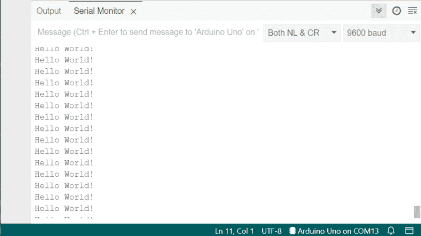
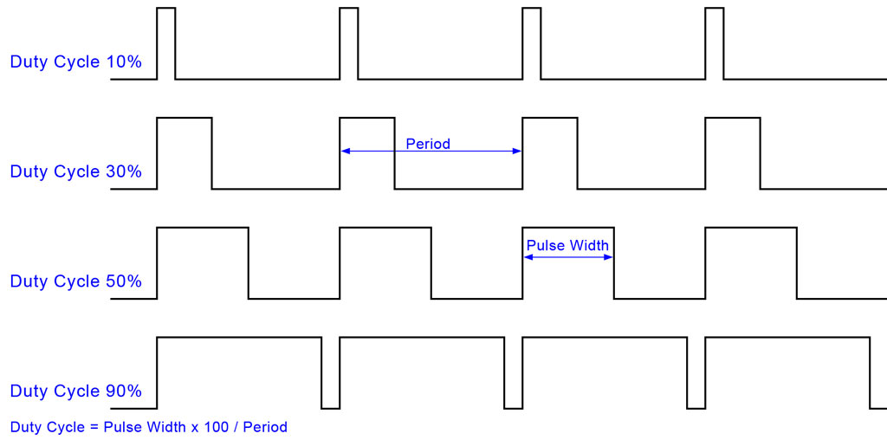

import { Tabs, TabItem } from '@astrojs/starlight/components';

:::caution
    This lesson, and all proceeding lessons, assumes you have a cursory knowledge of the C++ programming language. If you do not, we recommend reading tutorials such as [this one from W3schools](https://www.w3schools.com/cpp/cpp_getstarted.asp). There also exist excellent resources online such as StackOverflow to ask questions to.

    It is also recommended that you have read [2.6 Microcontrollers](/lessons/u2-electrical/26-microcontrollers/) before starting this lesson. 
:::

:::tip
    In addition to following this lesson, we recommend also reading the [Arduino Language Reference](https://docs.arduino.cc/language-reference/) to clear up gaps and search for any individual function you should need.
:::


### Code Structure

In any code run with the Arduino IDE, no matter the microcontroller, the code has a base structure as such:

```c++
void setup(){
    //Will run once on startup before anything else.
}

void loop(){
    //Will loop for as long as the MCU is powered
}
```

Without these two functions, no code will flash to or run on an MCU through the Arduino IDE (though other protocols are different).


### Serial

To communicate data from the MCU back to our computer through the wired connection, we can't use `cout << "data"` like we would in regular c++. Instead we use Serial.

Here is a snippet showing it's usage:
```c++

const int data = 5;

void setup(){
    Serial.begin(9600);             // Begin at a baud rate of 9600
    Serial.println("Hello World! (setup)"); // Prints some text, with a newline
    Serial.print("Some data: ");    // Prints some text, without a newline, so that the next text will appear on the same line
    Serial.println(data);           // Can also print simple variables, such as integers, longs, floats, chars, strings, and doubles.
}

void loop(){
    Serial.println("Hello World!");
    delay(500); // Delays the mainloop by 500ms
}
```
We start Serial by using the `Serial.begin(baud);` command. The baud rate is the speed of data transmission between two devices, in this case the MCU and the computer, and must match for effective data transmission. In the case of the program above, we use the standard value of `9600`.

To write data to serial, we can use the two functions `Serial.print();` amd `Serial.println();` shown above, as well as numerous others, which you can learn more about [here](https://docs.arduino.cc/language-reference/en/functions/communication/serial/). The list of functions should be at the bottom of the page.

To actually read the serial data, you can open the serial monitor on the IDE by clicking this icon in the top right: 


From there, you will be able to see every message that is sent through Serial from the MCU. If you do not see anything, try and check your connection to the MCU.
Be sure to set the baud rate to 9600, so that the messages get through.

.


### Input/Output

To control and communicate with circuits, as opposed to the computer, we use the GPIO (general purpose input/ouput) pins on the MCU. With them, we can read and write signals.

By default, pins are setup as input. We can configure this in the setup function with the `pinMode(pin, pinMode)`

```c++

void setup(){
    // To configure pin 13 to be output
    pinMode(13, OUTPUT);

    // To configure pin 12 to be input
    pinMode(12, INPUT);
}

```

There does exist a third mode `INPUT_PULLUP`, which defaults a pin to have a HIGH input reading instead of LOW when no circuit is connected to it.

#### Digital

Digital reads and writes have exactly two modes for both input and output: HIGH (operating voltage of the MCU),  with a value of 1, or LOW (ground), with a value of 0.

For example, consider the Blink program from [Lesson 3.2](/lessons/programming/02-uploading-code);

```c++

#define LED 13

void setup() {
  pinMode(LED, OUTPUT);
}

// the loop function runs over and over again forever
void loop() {
  digitalWrite(LED, HIGH);  // change state of the LED by setting the pin to the HIGH voltage level
  delay(1000);
  digitalWrite(LED, LOW);   // change state of the LED by setting the pin to the LOW voltage level
  delay(1000); 
}
```

Here, we used digitalWrite to output a HIGH (usually 5V or 3.3V) signal to pin 13, which is connected to an LED.


Now consider a circuit with a switch, where the input is connected to logic output (usually 5V or 3.3V, and output to pin 10. To detect if the switch was flipped, we would use the `digitalRead(pin)` function.

```c++
#define SWITCH 10

void setup() {
    Serial.begin(9600);
    pinMode(SWITCH, INPUT);
}

// the loop function runs over and over again forever
void loop() {
    if (digitalRead(SWITCH)){ // Returns 1 on input detection, 0 otherwise
        Serial.println("Switch on!");
    } else {
        Serial.println("Switch off...")
    }
    
    delay(250);
}

```


#### Analog

Voltages do not just exist as a flat on/off, and we can use the range in between to transmit values as well. Using Analog-supported pins on a microcontroller, we can read the voltage level as an integer from 0 (0V) to 1023 (Logic level of the MCU).

Take this example where we can read the rotation of a potentiometer based on it's signal output. We use the `analogRead(pin)` function to achieve the functionality above.

```c++

#define POT 10

void setup() {
    Serial.begin(9600);
    pinMode(POT, INPUT);
}

void loop() {
    // Will read 0-1023 based on rotation of potentiometer
    Serial.println(analogRead(POT));   

    delay(250);
}

```

### PWM

The Arduino and ESP32 do not natively contain methods of outputting raw analog signals, so instead they use PWM, or Pulse Width Modulation.

PWM works by switching the power supply to a component on and off extremely quickly. This can be used to provide an equal effect as if we were providing a constant raw analog signal. 

The most common measurement used to describe PWM signals is the *duty cycle*, which is the percentage of time that a signal is HIGH over any given period.



#### Outputting PWM

<Tabs syncKey="Boards">
    <TabItem label="Arduino">
        On an Arduino board, we use the `analogWrite(pin, value)` function to output PWM signals.The function accepts a range of value from 0-255, where the duty cycle is `input / 255 * 100%`. The only setup required is setting the pin to output. 

        For example, building on the earlier example with the potentiometer, we could map the value recieved to the correct range and output a PWM signal to control the brightness of an LED.     
        ```c++
            #define POT_PIN 10
            #define LED_PIN 11
    
            void setup() {
                pinMode(POT_PIN, INPUT);
                pinMode(LED_PIN, OUTPUT);
            }

            const int pot;
            const int led;

            void loop() {
                // Will read 0-1023 based on rotation of potentiometer
                pot = analogRead(POT_PIN);
                

                // linearly maps the potentiometer from a 0-1023 range to 0-255.
                led = map(pot,0,1023,0,255);

                // Write mapped value to LED
                analogWrite(
                    LED_PIN,
                    led
                );

                delay(250);
            }
        ```
    </TabItem>
    <TabItem label="ESP32">
        To generate a PWM signal with an ESP32, we use the LEDC module to drive PWM outputs.

        To use LEDC, we first need to set it up for an individual pin. We can do this with `ledcAttach(pin, frequency, resolution)`. We can then 
        ```c++
            #define POT_PIN 10
            #define LED_PIN 11


            #define PWM_FREQ 5000    // On/Off switches/second
            #define PWM_RESOLUTION 8 // Bits used to represent duty cycle
    
            void setup() {
                pinMode(POT_PIN, INPUT);
                pinMode(LED_PIN, OUTPUT);
                ledcAttach(LED_PIN, PWM_FREQ, PWM_RESOLUTION);
            }

            const int pot;
            const int led;

            void loop() {
                // Will read 0-1023 based on rotation of potentiometer
                pot = analogRead(POT_PIN);
                

                // linearly maps the potentiometer from a 0-1023 range to 0-255.
                led = map(pot,0,1023,0,255);

                // Write mapped value to LED
                ledcWrite(LED_PIN, led);
                
                delay(250);
            }
        ```
        PWM frequency represents the number of times an on/off cycle will repeat per second. A higher value is smoother, but may wear out components faster, a low value may result in audible noise or slow response.

        PWM resolution is the amount of bits the LEDC module will use for the duty cycle. So, in general, the accepted range when using `ledcWrite(pin, duty)` would be `0 -> (resolution**2)-1`.

        Depending on the model, ESP32s have somewhere between 8 and 16 LEDC channels, where some have a maximum resolution of 8 bits, and some 16 bits. It is important to always check the datasheet for your specific model before using PWM signals.
    </TabItem>
</Tabs>

