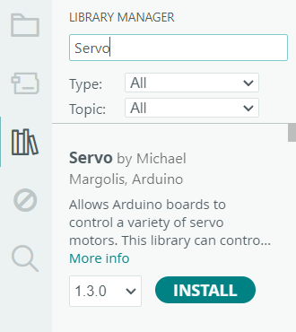

:::caution
    Build systems such as Make or CMake will not work out of the box with Arduino, since it acts as its own (highly abstracted) build system, and you will likely be unable to use libraries not explicitly ported to Arduino.
:::


As with any programming discipline, chances are that when we run into a difficult but common problem, somebody else has already solved it, and often in a better way than we could think of. Much of these solutions have been packaged into easy-to-use containers called libraries.

Libraries are collections of code written for a specific purpose, usually to provide some layer of  abstraction. Use of these libraries makes our code significantly easier to read.


For the purpose of this lesson, we will be using the [Servo](https://docs.arduino.cc/libraries/servo/) library, which allows generated data to be persistently stored on our Arduino or ESP32.


Now that we know which library we want to install, we need to first verify that it runs on our board. This specific library will run *only* on Arduino boards. For this example, that works perfectly.

We can now open the Arduino IDE and enter the library manager through the navigation bar on the left.


Enter `Servo` into the search bar. The first result should be a library by `Michael Margolis, Arduino.` Click the `Install` button and it should install the library for you.

Now, to use the functions provided by the library, you include it at the top of your code like this:
```c++
#include <Servo.h>
```
