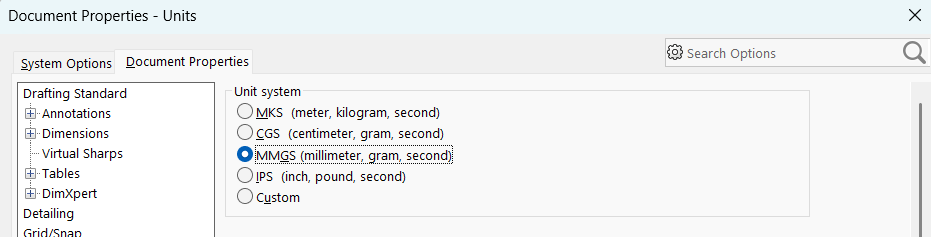
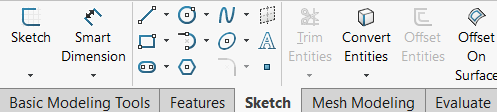
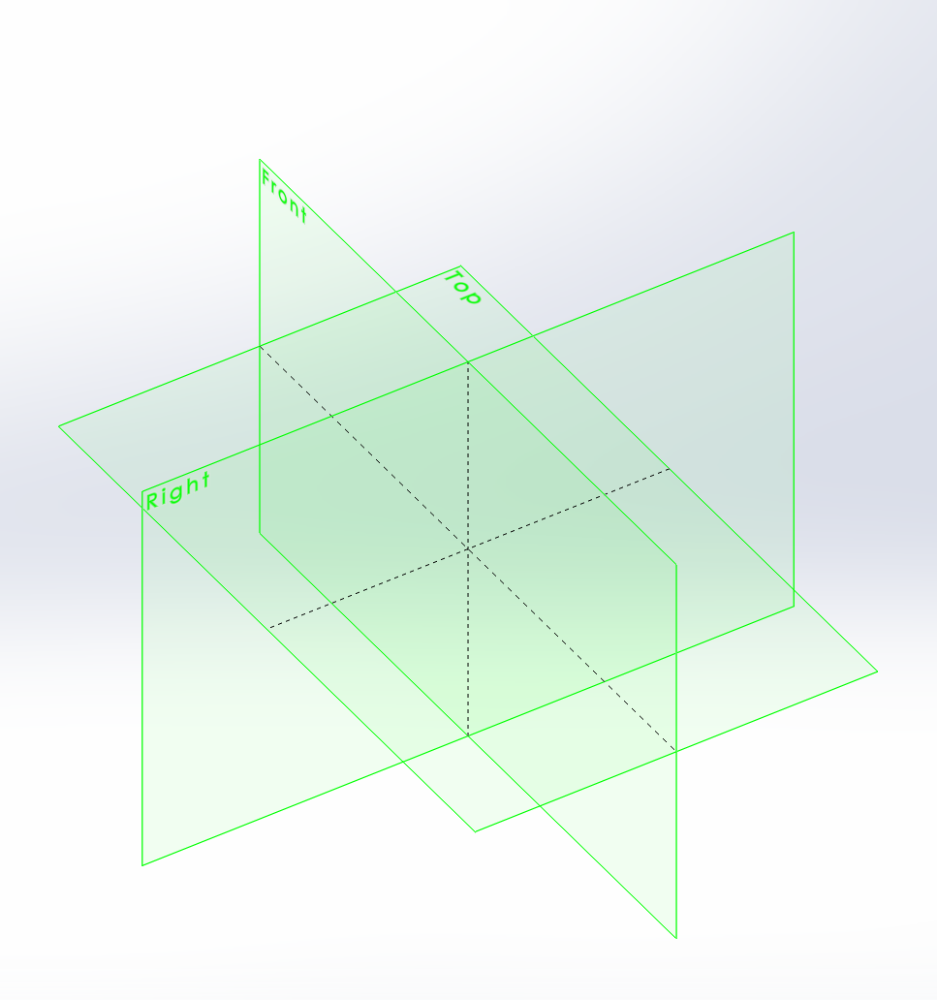

Upon opening Solidworks, the first thing you will see is a mostly empty screen with a toolbar on the top and on the right. To create a Part, we can look at the top left of the window and navigate through the menu to `File>New...` (Alternatively pressing `Ctrl-n`).

The window above will open up. For now we will select `Part`, then click `OK`. 

The first thing to check for is the units of the document. In Mechmania, we use metric, but Solidworks often defaults to imperial. If we look up once again at the top toolbar, we can navigate to `Tools>Options>Document Properties>Units`.

We want to set our units to `MMGS`, or to millimetres, grams, and seconds. Once that is done, click `OK` at the bottom of the window.

Now that we have set the units, the first thing we want to do is create a Sketch. Sketches are planes on which we can create 2D shapes and contours, which can then be brought into 3D in a variety of ways. 

We can create one by navigating to the `Sketch` tab in the the top left, then clicking the `Sketch` option.

Once clicked, we will see the three reference planes in our viewport window. Reference planes are infinite 2D objects used as a reference for sketches. In every new Part, there exists one for each standard axis, where the Top, Front, and Right planes are along the Y, X, and Z axes, respectively.

We can click on the ``
