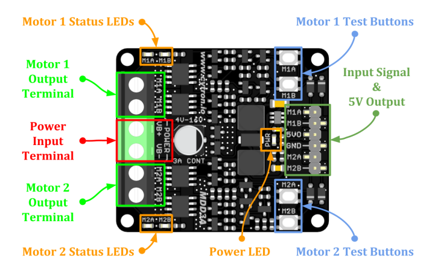
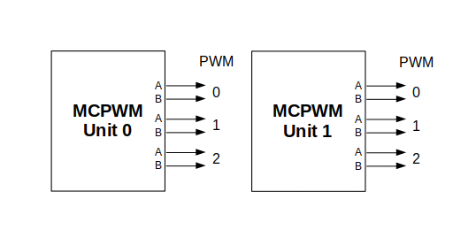
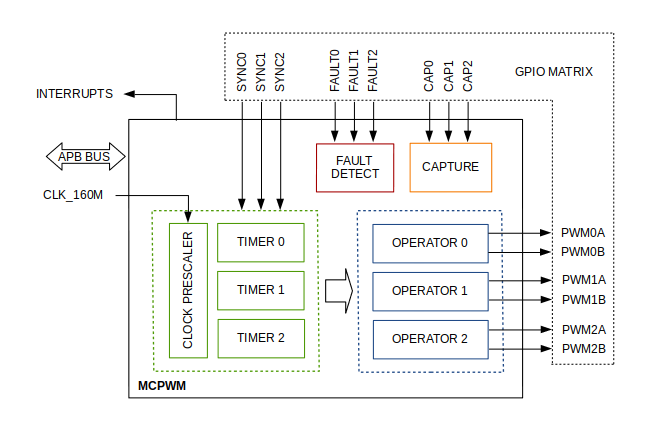

import { Tabs, TabItem } from '@astrojs/starlight/components';

:::tip
    This guide is missing information about Brushless DC (BLDC) motors. If you would like to fill it in, please [contribute](/getting-started/contributing)!
:::

:::caution
    It is recommended that you have read [2.8 Motors](/lessons/u2-electrical/28-motors/) before starting this lesson.
:::


For the purposes of this lesson, we will assume we are working with a standard Mechmania motor and driver pair; a 12V 1.5A (stall) brushed DC motor, and an [MDD3A motor driver](https://download.kamami.pl/p578534-MDD3A%20Datasheet.pdf).




Consider the pinout diagram above. On each driver, there are four channels, each labelled as `M1A/B` or `M2A/B`. We can drive two motors off of each driver, where each channel allows power flow through a motor lead. 

So, if a motor has leads A and B plugged into `M1A` and `M1B`, respectively, then powering `M1A` will provide motion in one direction, and `M1B` in another.

Consequently, when both `M1` pins are depowered, no motion occurs, and when both are powered, you will damage the motor and motor driver. On these motor drivers, we can also PWM the `M1` pins to operate the motor at an effective lower voltage, reducing the speed of the motors (though this functionality may be different on other motor drivers, always read the datasheets).


<Tabs syncKey="Boards">
    <TabItem label="Arduino">
        On Arduino, we use `analogWrite(pin,val)` to generate the required PWM signals.
        For example, if we wanted to drive a motor directly based upon the output of a joystick, we can implement the logic above as such:
        ```c++ wrap
        
        #define M1A 11
        #define M1B 12

        #define JOYSTICK_Y_PIN 13

        #define DEADZONE 40

        void setMotor(uint8_t m1a, uint8_t m1b, float val){
            
            // If the given speed > 0, then m1a triggers, if it speed < 0, then m1b triggers. 
            // Neither will trigger at the same time.
            if (val > 0) {
                analogWrite(m1a, val);
                ledcWrite(m1b, 0);
            } else if (val < 0) {
                analogWrite(m1a, 0); 
                analogWrite(m1b, val);
            } else {
                analogWrite(m1a, 0); 
                analogWrite(m1b, 0);
            }
        }


        void setup(){
            pinMode(JOYSTICK_X_PIN, INPUT);
            pinMode(M1A, OUTPUT);
            pinMode(M1B, OUTPUT);
        }


        void loop(){
            // Returns the vertical position of the joystick from a range of 0-1023
            int joystick = analogRead(JOYSTICK_X_PIN);
            
            joystick -= 512;
            
            // Analog joysticks tend to have a constant measured offset from 512 (ideal centre value) at rest, 
            // The deadzone acts as a filter on the offset, by making all values within the affected range 0.
            if ( abs(joystick) < DEADZONE ) joyX = 0;
            
            // We map the joystick value from a signed 10 bit integer to a signed 9 bit integer to match the 8 bit PWM resolution.
            setMotor(
                M1A,
                M1B,
                map(joystick,-512,512,-255,255)
            );
        }
        ```
    </TabItem>
    <TabItem label="ESP32">
        One easy option to drive motors with an ESP32 is to use LEDC to generate the required PWM signals. 
        For example, if we wanted to drive a motor directly based upon the output of a joystick, we can implement the logic above as such:
        ```c++ wrap
        
        #define PWM_FREQ 5000    // On/Off switches/second
        #define PWM_RESOLUTION 8 // Bits used to represent duty cycle
        
        #define M1A 11
        #define M1B 12

        #define JOYSTICK_Y_PIN 13

        #define DEADZONE 40

        void setMotor(uint8_t m1a, uint8_t m1b, float val){
            
            // If the given speed > 0, then m1a triggers, if it speed < 0, then m1b triggers. 
            // Neither will trigger at the same time.
            if (val > 0) {
                ledcWrite(m1a, val);
                ledcWrite(m1b, 0);
            } else if (val < 0) {
                ledcWrite(m1a, 0); 
                ledcWrite(m1b, val);
            } else {
                ledcWrite(m1a, 0); 
                ledcWrite(m1b, 0);
            }
        }


        void setup(){
            pinMode(JOYSTICK_X_PIN, INPUT);
            pinMode(M1A, OUTPUT);
            pinMode(M1B, OUTPUT);
            ledcAttach(M1A, PWM_FREQ, PWM_RESOLUTION);
            ledcAttach(M1B, PWM_FREQ, PWM_RESOLUTION);
        }


        void loop(){
            // Returns the vertical position of the joystick from a range of 0-1023
            int joystick = analogRead(JOYSTICK_X_PIN);
            
            joystick -= 512;
            
            // Analog joysticks tend to have a constant measured offset from 512 (ideal centre value) at rest, 
            // The deadzone acts as a filter on the offset, by making all values within the affected range 0.
            if ( abs(joystick) < DEADZONE ) joyX = 0;
            
            // We map the joystick value from a signed 10 bit integer to a signed 9 bit integer to match the 8 bit PWM resolution.
            setMotor(
                M1A,
                M1B,
                map(joystick,-512,512,-255,255)
            );
        }
        ```
        :::danger
            The material below is considered advanced compared to the rest of this section of the course, and is not immediately necessary for comprehension, though we recommend looking through it nonetheless. We encourage you to look up online any material you may not understand.
        :::

        While we can use LEDC to drive the motors, this does have a limit: Standard ESP32s have 16 channels, and newer models have just 8. At 2 channels per motor, if we were to create a full four-motor drivebase on a robot, we would be using either half or all of our available channels simply for driving our robot, leaving very few for servos or motors required for mechanisms.

        Thankfully, ESP32s have a separate built-in utility called [MCPWM](https://docs.espressif.com/projects/esp-idf/en/stable/esp32/api-reference/peripherals/mcpwm.html), a dedicated hardware PWM unit for all types of motors, DC, BLDC, servo, and stepper alike. Most of the ESP32 units contain 2 MCPWM units, each with 3 PWM pairs (6 channels), totalling an additional 12 PWM channels, all dedicated to motor function.
        
        Total MCPWM module:
        

        Individual Unit:
        
        
        If we consider the above diagrams, it follows that to individually drive a single pwm channel, for example pwm0a, then we need to index the unit, operator, and lane, as well as assigning a timer (for our purposes driving brushed DC motors, each PWM pair *within a unit* must have a unique timer).
        
        It is worth mentioning that while multiple timers should be used across PWM output pairs, each individual pair should have a single timer, or else both motor driver inputs may be on at the same time, and short the mosfet.

        We can expand the joystick example above to use MCPWM instead (using two motors instead of one to demonstrate MCPWM's functionality).
        ```c++ wrap 
        
        // MCPWM comes bundled with the ESP32 Arduino toolchain, so we do not need to install it
        #include "driver/mcpwm.h"

        #define JOYSTICK_RESOLUTION 9

        #define PWM_FREQ 5000
        #define M0A 11
        #define M0B 12
        
        #define M1A 15
        #define M1B 16

        void setMotor(mcpwm_unit_t unit, mcpwm_timer_t timer, float val){
            
            // Map joystick value to a duty percentage accepted by MCPWM
            float duty = abs(val) * 100.0f / ((1UL<<JOYSTICK_RESOLUTION)-1);
            duty = constrain(duty,0.0f,100.0f);

            if (val > 0) {
                mcpwm_set_duty(unit, timer, MCPWM_GEN_A, duty);
                mcpwm_set_duty_type(unit, timer, MCPWM_GEN_A, MCPWM_DUTY_MODE_0);

                mcpwm_set_signal_low(unit, timer, MCPWM_GEN_B); // Ensure other pin is OFF
            } else if (val < 0) {
                mcpwm_set_signal_low(unit, timer, MCPWM_GEN_A);

                mcpwm_set_duty(unit, timer, MCPWM_GEN_B, duty);
                mcpwm_set_duty_type(unit, timer, MCPWM_DUTY_MODE_0);
            } else {
                mcpwm_set_signal_low(unit, timer, MCPWM_GEN_A);
                mcpwm_set_signal_low(unit, timer, MCPWM_GEN_B);
            }
         }

         void setup(){
                
                // For demonstration purposes, we are running both the motors off of the 
                //  "same" pwm channels, but in reality in completely different hardware units
                //  Timers here can be the same since they are in different units, however for the same unit, timers MUST be different for each PWM pair

                // Pair 0
                mcpwm_gpio_init(MCPWM_UNIT_0, MCPWM0A, M0A);
                mcpwm_gpio_init(MCPWM_UNIT_0, MCPWM0B, M0B);
                // Pair 1
                mcpwm_gpio_init(MCPWM_UNIT_1, MCPWM0A, M1A);
                mcpwm_gpio_init(MCPWM_UNIT_1, MCPWM0B, M1B);
                
                // We use the struct provided by the MCPWM library to configure settings
                mcpwm_config_t pwm_conf;
                pwm_conf.frequency = 5000;        
                pwm_conf.cmpr_a = 0;          
                pwm_conf.cmpr_b = 0;          
                pwm_conf.counter_mode = MCPWM_UP_COUNTER;
                pwm_conf.duty_mode = MCPWM_DUTY_MODE_0;
                
                // Init mcpwm 
                mcpwm_init(MCPWM_UNIT_0, MCPWM_TIMER_0, &pwm_conf);
                mcpwm_init(MCPWM_UNIT_1, MCPWM_TIMER_0, &pwm_conf);

                // No need to configure pinMode(pin,mode) as MCPWM configures the pins automatically.
        }

        
        void loop(){
            int joystick = analogRead(JOYSTICK_X_PIN);
            joystick -= 512; 
            if ( abs(joystick) < DEADZONE ) joyX = 0;
            
            // Set motor 0
            setMotor(
                MCPWM_UNIT_0,
                MCPWM_TIMER_0,
                joystick
            );

            // Set motor 1
            setMotor(
                MCPWM_UNIT_1,
                MCPWM_TIMER_0,
                joystick
            );
        }
        ```
    </TabItem>
</Tabs>
